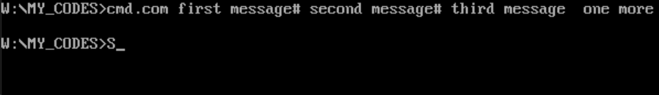
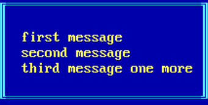

# cmd_output

Прогрмма для вывода рамки с коммандной строкой. Рамка сама подбирает свои размеры и выводится по центру экрана.

**Ширина рамки** — определяется самой длинной строкой

**Высота рамки** — количеством строк

## 🚀 Запуск
Запустите com файл и введите сообщение.

Пример:

  

После нажатия ENTER сообщение будет выведенно на экран.

  

## ✨ Функционал

* Максимальная длина строки 56 сиволов.

* Максимальное количетво строк 13.

* Чтобы начать новую строку нужно написать '#'
 
